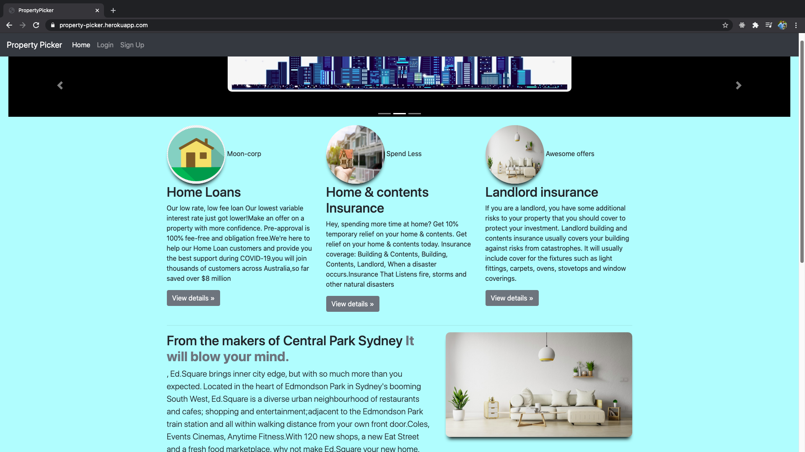

# Project Name
Property-Picker

## Table of contents
* [LiveDemoLink](#LiveDemoLink)
* [LoginDetails](#LoginDetails)
* [Description](#Description)
* [Screenshots](#screenshots)
* [Technologies](#technologies)
* [Setup](#Setup)
* [CodeExamples](#CodeExamples)
* [Features](#features)
* [status](#status)
* [WishList](#WishList)
* [Contact](#contact)

## LiveDemoLink
[LiveDemoLink](https://property-picker.herokuapp.com/)

## LoginDetails
EMAIL: kart@ga.com PASSWORD: chicken 

## Description
This is a Real Estate website where a customer can view the list of preperties available to buy and also the broker details for more info if needed. An Admin can upload properties, edit them or delete and also he can add a new broker, edit or delete.

## Screenshots


## Technologies
[Rails 5.2.4.3](https://rubyonrails.org/)


## Setup
<h5>To Play the game</h5>
* git fork(to get the code from my Repository to your remote repository)
* git clone "URL"(to get the code from your repository to the Local Repository)

<h5>To Update any codes to the existing Project do the steps as follows:</h5>
* git add -A
* git commit -m "your message"
* git pull upstream master
* git push origin master
* Pull request to merge the changes made


## CodeExamples
```html
<h5>Sample rails code:</h5>
<section class="form-auth text-center">
  <%= form_for @property, html: {multipart: true} do |f| %>
  <div class="field">
    <%= f.text_field :name, :class => 'form-control', :placeholder => 'name' %>
    <br>
  </div>
  <div class="field">
    <%= f.text_field :address, :class => 'form-control', :placeholder => 'address' %>
    <br>
  </div>
  <div class="field">
    <%= f.text_field :price, :class => 'form-control', :placeholder => 'price' %>
    <br>
  </div>
  <div class="field">
    <%= f.text_field :rooms, :class => 'form-control', :placeholder => 'bed rooms' %>
    <br>
    </div>
    <div class="field">
      <%= f.text_field :bathrooms, :class => 'form-control', :placeholder => 'bathrooms'%>
      <br>
    </div>
    <div class="field">
      <span>Broker:</span>
      <%= f.select :broker_id, options_from_collection_for_select(Broker.all, "id", "name") %>
      <br>
      <br>
    </div>
    <div class="field">
      <%= f.cl_image_upload :image %>
      <br>
      <br>
    </div>

    <div class="field">
      <%= f.submit :class => 'btn btn-success' %>
    </div>
  <% end %>
</section>
```

## Features
List of features ready:
* An Admin can edit the property, delete and add new property.
* He can also add a broker, delete and edit a broker
* Improved look and feel

To-do list:
* Option for the customer to negotiate with the admin
* some Advanced CSS effects to load images in home page automatically

## Status
Project is: _in progress_

## WishList
* Option to see Finance options and their eligibility and also all EMI options available

## Contact
Created by [@karthik](karthikeyansep27@gmail.com) - feel free to contact me!
